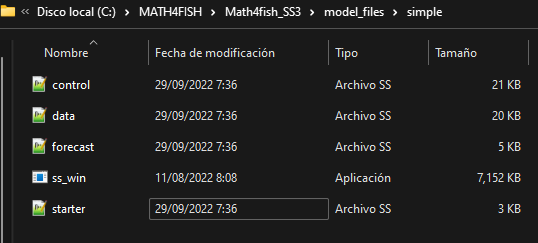

&nbsp; &nbsp;


# Archivos requeridos


```{css,echo=FALSE}


.scroll-200{
            max-height: 200px; 
            overflow-y: auto; 
            background-color: #f1f1f1;
            }
```


```{css,echo=FALSE}

/*----------LOGO above TOC---------*/

#TOC::before {
  content: "";
  display: block;
  height: 100px;
  margin: 2em 20px 40px 20px;
  background-image: url("LOGO_2SN_recortado.png");
  background-size: contain;
  background-position: center center;
  background-repeat: no-repeat;
}

```


```{r echo=F, message=F,warning=F,}

library(reshape2)
require(dplyr)
require(tidyr)
library(knitr) #Rmarkdown
library(ggplot2) # plot
library(patchwork) # plot
library(kableExtra) # genera tablas
library(r4ss)

mod_path<-(paste(getwd(),'/model_files/simple',sep=""))

knitr::opts_chunk$set(echo=T, warning=F, message=F)

```


Los archivos de datos necesarios para que SS3 funcione son los siguientes:

1.  **starter.ss**: archivo requerido que contiene los nombres de los archivos de datos y control, además de otros controles de ejecución.
2.  **data.ss**: archivo que contiene las dimensiones del modelo y los  datos
3.  **control.ss**: archivo que contiene la configuración de los parámetros
4.  **forecast.ss**: archivo que contiene especificaciones para puntos de referencia y proyecciones

Cuando el programa se inicia por primera vez, lee el archivo starter.ss, que normalmente debe estar ubicado en el mismo directorio desde el que se ejecuta SS3 (**ss.exe**). 


```{r pressure, echo=FALSE, fig.cap="", out.width = "80%" }

```


Los archivos de datos se pueden leer como objetos de lista en R usando las funciones SS_read*(). Los componentes de la lista deben estar en el mismo orden en que aparecen en el archivo de texto. Puede usar la función names() para ver todos los componentes de la lista.

&nbsp;
&nbsp;

## Starter.ss

SS3 comienza leyendo el archivo starter.ss, el cual contiene los nombres de los archivos de datos y control, además de otros controles de ejecución. Los nombres de los archivos de control.ss y data.ss deben coincidir con los nombres especificados en el archivo starter.ss. En esta sección se especifican los ajustes a los parámetros iniciales, summary y convergencia del modelo.  [Consulte la Guía de usuario de SS3: Sección 5 "Starter File"](https://nmfs-stock-synthesis.github.io/doc/SS330_User_Manual.html#starter-file).


Podemos ver el contenido del archivo  usando la función `SS_readstarter` de r4ss. En este link puedes [Descargar archivo starter](https://mariazuba.github.io/Math4fish_SS3/model_files/simple/starter.ss) y guardarlo en tu directorio de trabajo.


```{r echo=T, message=F,warning=F}

start    <- r4ss::SS_readstarter(file=file.path(mod_path,"starter.ss"),verbose = FALSE) 
DT_start <- start %>% data.frame() %>% t() 

kbl(DT_start[,1],booktabs=T,position="h!",caption="Contenido de archivo starter")%>% 
    kable_styling("striped",full_width = FALSE,font_size=12 )%>% 
    scroll_box(width="100%",height="500px")
      
```


&nbsp; &nbsp;

## Data.ss 

A continuación se describe como ingresar las especificaciones del modelo, definición de flotas/campañas y los datos de capturas, índices, descarte, composiciones de tallas y edades, entre otros.

Podemos leer el archivo  usando la función `SS_readdat` de r4ss y ver los componentes de la lista con la función `names()`. En este link puedes [Descargar archivo data](https://mariazuba.github.io/Math4fish_SS3/model_files/simple/data.ss) y guardarlo en tu directorio de trabajo.


```{r message=F,warning=F,class.output="scroll-200"}

# lee archivo data.ss
dat <- r4ss::SS_readdat(file = file.path(mod_path, start$datfile),verbose = FALSE)

# Genera Tabla de los componentes del objeto "dat". 
kbl(names(dat), booktabs = T,position="h!") %>% 
  kable_styling("striped",full_width=F,font_size=12)%>% 
  scroll_box(width="100%",height="500px")

```

&nbsp;
&nbsp;

### Dimensiones

En esta sección se especifican el número de años, meses/temporadas de las observaciones, número de edades, sexos, áreas, número de flotas y campañas, entre otras. [Consulte la Guía de usuario de SS3: Sección 7.5 "Model Dimensions"](https://nmfs-stock-synthesis.github.io/doc/SS330_User_Manual.html#model-dimensions).

```{r echo=T, message=F,warning=F}
esp<-data.frame(dat$styr,dat$endyr,dat$nseas,dat$months_per_seas[1],
                dat$Nsubseasons,dat$spawn_month,dat$Ngenders,dat$Nsexes,
                dat$Nages,dat$N_areas,dat$Nfleets)

# Genera Tabla
kbl(t(esp), booktabs = T,position="h!",caption = "Especificaciones de los datos") %>% 
  kable_styling("striped",full_width=F,font_size=12)

```

&nbsp;
&nbsp;

### Definición de flotas y campañas

En esta sección se especifica el tipo de flota (comercial o campañas), mes/temporada de la observación, areas donde opero la flota/campaña, unidades de medida de la observación y una opción para utilizar un multiplicador de la captura. [Consulte la Guía de usuario de SS3: Sección 7.6 "Fleet Definitions"](https://nmfs-stock-synthesis.github.io/doc/SS330_User_Manual.html#fleet-definitions).


```{r echo=T,message=F,warning=F}

kbl(dat$fleetinfo, booktabs = T,position="h!",caption = "Definición de flotas y campañas") %>% 
  kable_styling("striped",full_width=F,font_size=12)

```

&nbsp;
&nbsp;

### Captura comercial

Los datos de capturas ingresan por año, temporada de pesca, tipo de flota, valor observado de la captura y coeficiente de variación. **Catch data**: yr, seas, fleet, catch, catch_se. **catch_se**: standard error of log(catch). **NOTE**: catch data is ignored for survey fleets. [Consulte la Guía de usuario de SS3: Sección 7.9 "Catch"](https://nmfs-stock-synthesis.github.io/doc/SS330_User_Manual.html#catch).

```{r echo=T,message=F,warning=F}
catch<-dat$catch 

kbl(catch, booktabs = T,position="h!",caption = "Datos de captura comercial") %>% 
  kable_styling("striped",full_width=F,font_size=12)%>% 
  scroll_box(width="100%",height="500px")


```

&nbsp;
&nbsp;

### Índices de abundancia {.tabset .tabset-fade }

En las primeras líneas se describen algunas especificaciones de los índices, como las unidades de medida y distribución del error, para posteriormente ingresar los datos por año, mes, flota y coeficiente de variación. [Consulte la Guía de usuario de SS3: Sección 7.10 "Indices"](https://nmfs-stock-synthesis.github.io/doc/SS330_User_Manual.html#indices).


#### Especificaciones
```{r echo=T,message=F,warning=F}
CPUEinfo<-dat$CPUEinfo #contiene las especificaciones de las campañas

kbl(CPUEinfo, booktabs = T,position="h!",caption = "Especificaciones de los índices") %>% 
  kable_styling("striped",full_width = FALSE,font_size=12)
```

#### Formato de los Datos
```{r echo=T, message=F,warning=F}
CPUE<-dat$CPUE # contiene los datos de campañas

kbl(CPUE, booktabs = T,position="h!",caption = "Formato de los datos") %>% 
  kable_styling("striped",full_width = FALSE,font_size=12)%>% 
  scroll_box(width="100%",height="500px")

```

&nbsp;
&nbsp;

### Composiciones de tallas {.tabset .tabset-fade }

En esta sección se ingresan los datos de composiciones de tallas por año, mes, tipo de flota, sexo y tamaño de muestra, especificando previamente el método de agrupamiento (bins) de las tallas, distribución de la estructura de error, entre otras especificaciones. [Consulte la Guía de usuario de SS3: Sección 7.14 "Length Composition Data Structure"](https://nmfs-stock-synthesis.github.io/doc/SS330_User_Manual.html#length-composition-data-structure).


#### FISHERY

```{r echo=T, message=F,warning=F}
tallas_a<-dat$lencomp  %>% filter(FltSvy==1)

kbl(tallas_a, booktabs = T,position="h!",digits = 0,caption = "Datos de composición de tallas") %>% 
  kable_styling("striped",full_width = FALSE,font_size=12) %>% 
  scroll_box(width="100%",height="500px")

```

#### SURVEY 1

```{r echo=T, message=F,warning=F}
tallas2<-dat$lencomp  %>% filter(FltSvy==2)

kbl(tallas2, booktabs = T,position="h!",digits = 0,
caption = "Datos de composición de tallas") %>% 
  kable_styling("striped",
                full_width = FALSE,font_size=12)%>% 
  scroll_box(width="100%",height="500px")

```

#### SURVEY 2

```{r echo=T, message=F,warning=F}
tallas3<-dat$lencomp  %>% filter(FltSvy==3)

kbl(tallas3, booktabs = T,position="h!",digits = 0,caption = "Datos de composición de tallas") %>% 
  kable_styling("striped",full_width = FALSE,font_size=12)%>% 
  scroll_box(width="100%",height="500px")

```


&nbsp;
&nbsp;

## Control.ss

La función principal del archivo de control es definir los parámetros que utilizará el modelo.  Cada línea de parámetro contiene: un valor mínimo (LO), máximo (HI), inicial (INIT), valor esperado (PRIOR), coeficiente de variación del valor esperado (PRIOR SD), tipo de distribución de error del valor esperado (PRIOR TYPE), fase de estimación (PHASE). Se pueden aplicar tres tipos de propiedades variables en el tiempo a un parámetro base: vinculación ambiental (Env var & Link), desviación aleatoria (Dev link, Dev min yr, Dev max yr, Dev phase) y bloques o tendencia (Block y Block function). 

[Descarga archivo control](https://mariazuba.github.io/Math4fish_SS3/model_files/simple/control.ss)

```{r echo=F,message=F,warning=F,class.output="scroll-200"}

# Read in ctl file. Note that the data fileR object is needed so that SS_readctl
# assumes the correct data structure
ctl <- r4ss::SS_readctl(file = file.path(mod_path, start$ctlfile),
                        verbose = FALSE, use_datlist = TRUE, datlist = dat)

#names(ctl) # see names of the list components of ctl

```

&nbsp;
&nbsp;

### Parámetros biológicos {.tabset .tabset-fade }

#### Especificaciones 

1. *Tipos de mortalidad natural*: 0 = 1Parm; 1 = N_breakpoints; 2 = Lorenzen; 3 = agespecific; 4 = agespec with seas interpolate no additional input for selected M option; read 1P per morph
  
2. *Modelo de crecimiento*:  1 = vonBert with L1&L2; 2 = Richards with L1&L2; 3 = age_specific_K; 4 = not implemented

3. *CV del patrón de crecimiento*: 0 CV=f(LAA); 1 CV=F(A); 2 SD=F(LAA); 3 SD=F(A); 4 logSD=F(A)

4. *Opción de madurez*: 1 = length logistic; 2 = age logistic;  3 = read age-maturity matrix by growth_pattern;  4 = read age-fecundity;  5 = disabled;  6 = read length-maturity

5. *Opción de fecundidad*: (1) eggs=Wt*(a+b*Wt); (2) eggs=a*L^b; (3) eggs=a*Wt^b;  (4) eggs=a+b*L;  (5) eggs=a+b*W

6. *Opción de hermaphroditismo*:  0 = none;  1 = female-to-male age-specific fxn;  -1 = male-to-female age-specific fxn

&nbsp;
&nbsp;

#### Parámetros

```{r echo=F, message=F,warning=F}

parbio<-ctl$MG_parms

kbl(parbio, booktabs = T,position="h!",
caption = "Parámetros biológicos") %>%
  kable_styling("striped",
                full_width = FALSE,font_size=12)%>% 
  scroll_box(width="100%")


```

&nbsp;
&nbsp;

### Reclutamiento {.tabset .tabset-fade }

&nbsp;
&nbsp;

#### Especificaciones


1. *SR_function*: 2 = Ricker; 3 = std_B-H; 4 = SCAA; 5 = Hockey; 6 = B-H_flattop; 7 = survival_3Parm; 8 = Shepard_3Parm

2. *do_recdev*: 0 = none;  1 = devvector;  2 = simple deviations

&nbsp;
&nbsp;

#### Parámetros

```{r echo=F, message=F,warning=F}

parrecl<-ctl$SR_parms

kbl(parrecl, booktabs = T,position="h!",
caption = "Reclutamiento") %>%
  kable_styling("striped",
                full_width = FALSE,font_size=12)%>% 
  scroll_box(width="100%")


```

&nbsp;
&nbsp;

### Capturabilidad {.tabset .tabset-fade }

#### Especificaciones

```{r echo=F, message=F,warning=F}

parQ_option<-ctl$Q_options

kbl(parQ_option, booktabs = T,position="h!") %>%
  kable_styling("striped",
                full_width = FALSE,font_size=12)

```

#### Parámetros 

```{r echo=F, message=F,warning=F}

parQ_par<-ctl$Q_parms

kbl(parQ_par, booktabs = T,position="h!") %>%
  kable_styling("striped",
                full_width = FALSE,font_size=12)%>% 
  scroll_box(width="100%")


```

&nbsp;
&nbsp;

### Selectividad

&nbsp;
&nbsp;

#### Selectividad a la talla {.tabset .tabset-fade }

##### Especificaciones

```{r echo=F, message=F,warning=F}

parsel_type<-ctl$size_selex_types

kbl(parsel_type, booktabs = T,position="h!",
caption = "Especificación de la selectividad a la talla") %>%
  kable_styling("striped",
                full_width = FALSE,font_size=12)

```

##### Parámetros

```{r echo=F, message=F,warning=F}

parsel_par<-ctl$size_selex_parms

kbl(parsel_par, booktabs = T,position="h!",
caption = "Parámetros de selectividad a la talla") %>%
  kable_styling("striped",
                full_width = FALSE,font_size=12)%>% 
  scroll_box(width="100%")


```

&nbsp;
&nbsp;

#### Selectividad a la edad {.tabset .tabset-fade }

##### Especificaciones

```{r echo=F, message=F,warning=F}

parsel_type<-ctl$age_selex_types

kbl(parsel_type, booktabs = T,position="h!",
caption = "Especificación de la selectividad a la edad") %>%
  kable_styling("striped",
                full_width = FALSE,font_size=12)

```

##### Parámetros

```{r echo=F, message=F,warning=F}

parsel_par<-ctl$age_selex_parms

kbl(parsel_par, booktabs = T,position="h!",
caption = "Parámetros de selectividad a la edad") %>%
  kable_styling("striped",
                full_width = FALSE,font_size=12)%>% 
  scroll_box(width="100%")


```

&nbsp;
&nbsp;

## Forecast.ss

En este archivo se pueden especificar los puntos biológicos de referencia, los años de proyección y reglas de control, entre otras especificaciones. [Consulte la Guía de usuario de SS3: Sección 6 "Forecast File"](https://nmfs-stock-synthesis.github.io/doc/SS330_User_Manual.html#forecast-file).

A continuación se muestra el archivo crudo que puedes encontrar al [Descarga archivo forecast](https://mariazuba.github.io/Math4fish_SS3/model_files/simple/forecast.ss). Cada línea corresponde a una especificación comentada con simbolo #.

Para revisar las líneas que se están leyendo de nuestro código podemos utilizar la función `SS_readforecast` de la librería r4ss y de esta forma visualizar los datos que nos interesan.

```{r echo=T, message=F,warning=F}

# Lee el archivo forecast

fore <- r4ss::SS_readforecast(file = file.path(mod_path, "forecast.ss"),
                              verbose = FALSE)
# can also read in wtatage.ss for an empirical wt at age model using
# r4ss::SS_readwtatage()
#names(fore) # see names of the list components of forecast

# Selecciono los datos que puedo ver el lista
fore_kbl<-data.frame(fore[2:8],fore[10:13],fore[15:33])

# Genera la tabla 
kbl(t(fore_kbl), booktabs = T, position="h!")%>%
  kable_styling(latex_options = c("striped"),
                full_width = FALSE,font_size=12)%>% 
  scroll_box(width="100%",height="500px")

```
