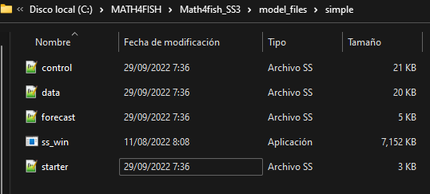

# Cómo ejecutar modelos SS3


&nbsp;
&nbsp;

Para comenzar descargue los archivos del modelo simple ([**starter.ss**](https://mariazuba.github.io/Math4fish_SS3/model_files/simple/starter.ss), [**data.ss**](https://mariazuba.github.io/Math4fish_SS3/model_files/simple/data.ss), [**forecast.ss**](https://mariazuba.github.io/Math4fish_SS3/model_files/simple/forecast.ss),
[**control.ss**](https://mariazuba.github.io/Math4fish_SS3/model_files/simple/control.ss)) y el ejecutable SS3 ([**ss.exe**](https://github.com/mariazuba/Math4fish_SS3/blob/master/model_files/simple/ss_win.exe), hacer clic en Download), y luego guardelos en su directorio de trabajo, como se muestra a continuación. 


&nbsp;
&nbsp;

```{r pressure, echo=FALSE, fig.cap="", out.width = "80%", fig.align='center'}

```

&nbsp;
&nbsp;


Para ejecutar el modelo simple utilizaremos la función `run_SS_models` de la libreria r4ss . Debemos especificar el directorio de trabajo que contiene los archivos del modelo (dirvec = mod_path) y  el nombre del ejecutable (model=exe_path) como se muestra a continuación.

```{r echo=T, message=F,warning=F,eval=F,incluide=F}

library(r4ss)

mod_path <- paste(getwd(),'/model_files/simple',sep="")
exe_path <- paste(mod_path,"ss_win.exe",sep= "/")

r4ss::run_SS_models(dirvec=mod_path, model=exe_path,skipfinished=FALSE)

```

Al iniciar la ejecución, SS3 siempre lee los archivos **starter.ss, data.ss** y **forecast.ss, control.ss** en el mismo orden, escribiendo las salidas de debugging en **echoinput.sso**  y advertencias en **warnings.sso** a medida que se lee. 

Si la salida no se ejecuta o NO SUPERA el mensaje **Estimating...please wait...**, entonces siga los siguientes pasos:

- Asegurese de que todos los archivos y directorios tengan el nombre correcto.
- Verifique que el archivo **starter.ss** tenga los nombres correctos de los archivos de **control.ss** y **data.ss**.
- Si SS3 comienza a leer archivos y luego falla, revise los archivos **warnings.sso** y **echoinput.sso**. Mirar el último contenido escrito en **echoinput.sso** y compararlo con sus archivos de entrada puede proporcionar pistas sobre dónde (y posiblemente por qué) falló la ejecución.


Si la salida SI SUPERA el mensaje **Estimating...please wait...** entonces la estructura de los datos de entrada de SS3 es correcta y por lo tanto, debería ver un resultado en la línea de comando similar a la que se muestra a continuación.
 
&nbsp;
&nbsp;

```{r pressure2, echo=FALSE, fig.cap="", out.width = "60%", fig.align='center'}

knitr::include_graphics("figuras/run_simple_initial.png")

```

&nbsp;
&nbsp;

Luego, SS3 va a la sección de procedimiento donde ADMB realiza cambios iterativos de parámetros (iteration) para minimizar la función de verosimilitud (-log(L)), como se muestra a continuación. 


&nbsp;
&nbsp;

```{r pressure3, echo=FALSE, fig.cap="", out.width = "100%", fig.align='center'}


```

&nbsp;
&nbsp;

Cuando ADMB logra la convergencia, el control pasa a sdphase para el cálculo de la varianza de los parámetros (a menos que se especifique la opción `-nohess`). Después de sdphase, SS3 pasa a la sección de código de benchmark y forecast y luego al reporte final. Cuando se completa la ejecución de SS3, aparece **!! Run has completed !!**. 

Se recomienda revisar el archivo **warnings.sso** en busca de problemas y sugerencias, independientemente si la ejecución se completó correctamente o no, ya que incluye sugerencias para mejorar la especificación del modelo y advertencias sobre errores comunes de especificación del modelo. 

Si SS3 no fue ejecutado correctamente, no verá el mensaje **!! Run has completed !!**.


&nbsp;
&nbsp;

```{r pressure4, echo=FALSE, fig.cap="", out.width = "60%", fig.align='center'}

knitr::include_graphics("figuras/run_simple.png")

```


&nbsp;
&nbsp;


Los archivos de salida que contienen resultados normalmente se escriben en el directorio de trabajo donde fue ejecutado el modelo SS3, como se muestra a continuación. 

```{r message=F,warning=F,incluide=F}

mod_path <- paste(getwd(),'/model_files/simple',sep="")

dir(mod_path)

```
&nbsp;
&nbsp;

Muchos archivos de texto de salida se crean durante la ejecución del modelo. Los archivos de salida más útiles se pueden dividir en :

- **Archivos que contienen resultados**. Estos archivos incluyen **ss_summary.sso** y **Report.sso** que contienen los resultados del modelo resumidos de diferentes maneras. 
- **.ss_new files**. Estos archivos repiten los archivos de entrada SS3, pero incluyen comentarios  estandarizados. Los valores deben ser los mismos que los archivos de entrada, excepto **control.ss_new**, que actualiza los valores iniciales a los valores estimados finales. Los archivos **.ss_new** pueden ser útiles para estandarizar los comentarios en los archivos de entrada y se pueden verificar para asegurarse de que SS3 interpretó las entradas como pretendía el usuario.
- **Archivos utilizados para debugging**. Estos archivos incluyen **warnings.sso** y **echoinput.sso**.


&nbsp;
&nbsp;

# Cómo crear nuevos modelos SS3


Hay muchos flujos de trabajo potenciales para desarrollar un nuevo modelo SS3, pero una técnica común es comenzar con un modelo existente y cambiarlo por partes. La técnica básica es:

1. Encuentre un modelo de trabajo existente (quizás uno de los modelos de ejemplo SS3 disponibles en el repositorio de ejemplos de usuario o quizás un modelo más similar en forma al modelo que planea crear).

2. Editar partes del modelo e intentar ejecutar a medida que avanza para verificar que SS3 pueda leer correctamente sus entradas y que tengan sentido lógico (consejo: use options  `-stopph 0 -nohess` para reducir el tiempo de ejecución con cada iteración de verificación de entradas al no estimar nada y no invertir la hessiana).


 A continuación mostramos el flujo de trabajo para modificar archivos de entrada y ejecutar modelos utilizando la [Guía de library r4ss](https://r4ss.github.io/r4ss/vignettes/r4ss-intro-vignette.html) .

Demostraremos esto creando un nuevo directorio para nuestro nuevo modelo (`new_mod_path`) y luego copiaremos los archivos del directorio que contiene el modelo inicial (`mod_path`) en el nuevo directorio, como se indica a continuación.

```{r message=F,warning=F}

# initial model to modify
mod_path <- paste(getwd(),'/model_files/simple',sep="")

# create a new directory to put a new, modified version of the model
new_mod_path <- paste(getwd(),'/model_files/simple_new',sep="")
```


Se utiliza la funcion `copy_SS_inputs` de la librería r4ss para copiar los archivos del directorio de trabajo del modelo inicial (`dir.old=mod_path`) al directorio de trabajo del nuevo modelo (`dir.new=new_mod_path`).


```{r message=F,warning=F,include=T,results='hide'}

library(r4ss)

copy_SS_inputs(dir.old = mod_path, dir.new = new_mod_path)

```


Luego podemos leer los archivos copiados en nuestro nuevo directorio como objetos de lista en R usando las funciones `SS_read*()`.


```{r message=F,warning=F}

start <- r4ss::SS_readstarter(file = file.path(new_mod_path, "starter.ss"), verbose = FALSE)

# note the data and control file names can vary, so are determined from the 
# starter file.

dat <- r4ss::SS_readdat(file = file.path(new_mod_path, start$datfile),verbose = FALSE)

# Read in ctl file. Note that the data fileR object is needed so that SS_readctl
# assumes the correct data structure

ctl <- r4ss::SS_readctl(file = file.path(new_mod_path, start$ctlfil),verbose = FALSE,
                        use_datlist = TRUE, datlist = dat)

fore <- r4ss::SS_readforecast(file = file.path(new_mod_path, "forecast.ss"),verbose = FALSE)

# can also read in wtatage.ss for an empirical wt at age model using
# r4ss::SS_readwtatage()

```


A continuación investigamos el modelo, cada uno de los archivos de entrada se lee en R como una lista. Los componentes de la lista deben estar en el mismo orden en que aparecen en el archivo de texto. Use `names()` para ver todos los componentes de la lista:

```{r message=F,warning=F,class.output="scroll-200"}

names(start) # see names of the list components of starter

```

También se puede hacer referencia a un elemento específico para ver los componentes. Por ejemplo, podemos mirar la sección de parámetros de mortalidad y crecimiento (MG_parms):


```{r message=F,warning=F,class.output="scroll-200"}

ctl$MG_parms

```


&nbsp;
&nbsp;

Puede realizar cambios estructurales básicos o grandes en su modelo en R. Por ejemplo, el valor inicial de M se puede cambiar:


```{r message=F,warning=F,eval=F}

# view the initial value
ctl$MG_parms["NatM_p_1_Fem_GP_1", "INIT"]
#> [1] 0.1

#change it to 0.2
ctl$MG_parms["NatM_p_1_Fem_GP_1", "INIT"] <- 0.2

```


Al realizar grandes cambios estructurales, es posible que sea necesario agregar elementos adicionales que antes eran NULL. 

Algunas entradas requeridas están especificadas en otras entradas, por lo que es importante tener en cuenta que cambiar una opción puede hacer que SS3 espere una cantidad diferente de valores en los archivos de entrada que antes. La mayoría de las veces, estas  especificaciones se leen justo después de la opción.

El [manual de usuario SS3](https://nmfs-stock-synthesis.github.io/doc/SS330_User_Manual.html) se puede utilizar como guía editar su modelo. Las especificaciones se indican en el manual.

Para averiguar los nombres en el objeto de la lista r4ss, puede ser necesario realizar cambios directamente en los archivos de entrada y luego leerlos nuevamente en R, o buscar en el código fuente los nombres de los elementos de la lista. Por ejemplo, el código fuente de `SS_readctl()` cuando se usa un archivo SS3.30 se encuentra en https://github.com/r4ss/r4ss/blob/main/R/SS_readctl_3.30.R.


También se pueden modificar las especificaciones en otros archivos. Por ejemplo, la biomasa objetivo se puede modificar en el archivo **forecast.ss**.

```{r echo=T,message=F,warning=F,eval=F }
fore$Btarget
#> [1] 0.342
fore$Btarget <- 0.45
fore$Btarget
#> [1] 0.45

```


Las funciones `SS_write*()` se pueden usar para escribir los objetos R de entrada de SS3 modificados en archivos de entrada:

```{r message=F,warning=F}

r4ss::SS_writestarter(start, dir = new_mod_path, overwrite = TRUE, 
                      verbose = FALSE)
#> overwriting file: simple_new/starter.ss
r4ss::SS_writedat(dat, outfile = file.path(new_mod_path, start$datfile), 
                  overwrite = TRUE, verbose = FALSE)
r4ss::SS_writectl(ctl, outfile = file.path(new_mod_path, start$ctlfile),
                  overwrite = TRUE, verbose = FALSE)
r4ss::SS_writeforecast(fore, dir = new_mod_path, file = "forecast.ss", 
                       overwrite = TRUE, verbose = FALSE)

```


Si realiza cambios en los archivos del modelo de entrada que hacen que SS3 no pueda analizar el archivo, las funciones `SS_write*()` pueden generar un error (y, con suerte, brindar un mensaje informativo sobre el motivo). Sin embargo, es posible que se escriba un archivo de modelo de SS3 no válido, por lo que la verdadera prueba es si es posible o no ejecutar SS3 con los archivos de modelo modificados.

Si necesita ayuda para solucionar problemas de las funciones `SS_read*()` o `SS_write*()` o desea informar un error, publique un problema en el repositorio r4ss.


El modelo ahora se puede ejecutar con la función `run_SS_models` como se muestra a continuación:


```{r message=F,warning=F,eval=F}

r4ss::run_SS_models(dirvec = new_mod_path, model = exe_path ,skipfinished = FALSE)

```


Si no está seguro de haber realizado la configuración correcta (p. ej., agregando el número correcto de líneas de parámetros para una configuración de capturabilidad elegida), intente ejecutar el modelo con `maxphase = 0` en el archivo de **start.ss** y la opción ADMB `-nohess` (o para SS3 3.30. 16 y posteriores, ejecute el modelo con opciones de línea de comando `-stopph 0 -nohess`, no es necesario cambiar el archivo **start.ss**). Si se completa la ejecución del modelo, puede comparar el archivo **control.ss_new** y el primer conjunto de datos en **data.ss_new** con sus archivos de entrada de SS3 para asegurarse de que SS3 interpretó los valores según lo previsto. Si la ejecución finaliza antes de completarse, puede buscar en **warning.sso** y **echoinput.sso** para obtener pistas sobre el problema de su configuración.


## Fases de estimación de parámetros

Las fases se utilizan dentro de ADMB para decirle al programa en qué orden se deben estimar los parámetros. Para obtener más detalles sobre las fases en ADMB, consulte el [manual de usuario de ADMB](http://www.admb-project.org/docs/manuals/). 

* Una **fase negativa** indica que el parámetro no se estima, sino que se especifica. 

* Una **fase positiva** indica que el parámetro será estimado. Los parámetros con una fase positiva más baja se estimarán antes que aquellos con una fase positiva más alta.


### ¿En qué fase debería poner un parámetro estimado? 


Si bien existe variabilidad entre los analistas y los modelos en la forma en que se utiliza la fase, en general, los parámetros con fases positivas bajas deben ser para valores que definen la escala de la población (es decir, R0, mortalidad natural, steepness, selectividad). 

Los parámetros para afinar los ajustes a los datos a menudo se estiman en fases posteriores (es decir, parámetros de capturabilidad, crecimiento y desviación del reclutamiento). Muchos modelos usan fases positivas de aproximadamente 1 a 5, aunque es posible usar valores de fase más altos.

Cuando se ejecuta un modelo sin estimar nada, las fases se ignoran; debido a que no hay estimación, ejecutar sin estimación es como incluir una fase negativa para todos los parámetros.


## Flujo de trabajo para llegar a un modelo final

¡Es importante recordar que llegar a un modelo final lleva tiempo y muchas iteraciones! Es importante realizar pequeñas revisiones, volver a ejecutar el modelo y ver cómo ha cambiado el modelo con cada pequeña revisión. Por lo general, se requieren muchas ejecuciones intermedias del modelo antes de llegar a un modelo final. 

La creación de secuencias de comandos con funciones r4ss es una forma de desarrollar un flujo de trabajo reproducible y coherente  de SS3. Sin embargo, hay muchas formas de ejecutar y modificar los modelos de SS3. Lo más importante es encontrar un flujo de trabajo que funcione  y que los cambios que se realizan en un modelo puedan ser documentados. Como mínimo, mantener notas dentro de la carpeta de la ejecución o en otro lugar con respecto a los cambios específicos de la ejecución. El control de versiones (como git) es otra herramienta que puede ayudar a realizar un seguimiento de los cambios en los modelos. 

A continuación, se muestran algunas sugerencias sobre los pasos a seguir a medida que itera hacia su modelo "final".

### 1. Ejecutar el modelo sin estimación

Primero, verifique que SS3 lea los archivos de entrada según lo previsto. Utilice las opciones de línea de comando `-stopph 0 -nohess` para ejecutar el modelo sin estimación. Luego, examine los archivos de **warning.sso**, **echoinput.sso** y **.ss_new files** producidos para ver cómo SS3 interpretó sus archivos de entrada y si fue como pretendía.

Una vez que haya verificado que SS3 está leyendo su entrada correctamente, también puede considerar ajustar los parámetros de selectividad, crecimiento y reclutamiento.

### 2. Ejecutar estimando algunos parámetros

Intente cambiar la fase máxima para que sea mayor que 0 (quizás 2 o 3) para estimar algunos pero no todos los parámetros. Haga esto usando `-stopph x -nohess`, donde x debe ser la fase máxima deseada (por ejemplo, 2 o 3). `-nohess` todavía se usa para reducir el tiempo de ejecución. Durante esta etapa de las ejecuciones del modelo, debe intentar ajustar el modelo para resolver todos los patrones principales en los residuales. Esto puede incluir considerar y realizar cambios en la estructura del modelo.

### 3. Ejecutar estimando todos los parámetros

Una vez que se hayan resuelto todos los patrones principales en los residuos, intente estimar todos los parámetros en el modelo. Cambie la fase máxima para incluir todas las fases de su modelo (es decir, igual o superior a la fase más alta especificada en su modelo). Querrá hacer varias ejecuciones para diferentes propósitos de refinamiento del modelo en este momento:

1. Realice una o más corridas con la hessiana estimada para obtener la varianza de las desviaciones de reclutamiento y luego use este vector de varianzas para ajustar la rampa de ajuste del sesgo (consulte el Manual del usuario de SS3 para obtener detalles adicionales).
2. Realice ejecuciones con o sin estimar la hessiana para ajustar las ponderaciones de datos.
3. Ejecute el modelo varias veces y altere los valores iniciales (la opción de fluctuación se selecciona en starter.ss). Esto ejecuta el modelo con nuevos valores de parámetros iniciales para determinar si es posible un mejor ajuste del modelo utilizando diferentes valores iniciales.


Después de estas ejecuciones, su modelo debería estar ajustado y listo para las ejecuciones finales.


```{css,echo=FALSE}
.scroll-200{
            max-height: 200px; 
            overflow-y: auto; 
            background-color: #f1f1f1;
            }
```


```{css,echo=FALSE}

/*----------LOGO above TOC---------*/

#TOC::before {
  content: "";
  display: block;
  height: 100px;
  margin: 2em 20px 40px 20px;
  background-image: url("LOGO_2SN_recortado.png");
  background-size: contain;
  background-position: center center;
  background-repeat: no-repeat;
}

```


```{r echo=F, message=F,warning=F,}

library(reshape2)
require(dplyr)
require(tidyr)
library(knitr) #Rmarkdown
library(ggplot2) # plot
library(patchwork) # plot
library(kableExtra) # genera tablas
library(r4ss)
library(ss3diags)

# remotes::install_github("gadget-framework/rgadget")
# library(Rgadget) # tengo problemas para instalar esta libreria


#remotes::install_github("PIFSCstockassessments/ss3diags")

mod_path<-(paste(getwd(),'/quarter/10a_anchcadiz',sep=""))

knitr::opts_chunk$set(echo=T, warning=F, message=F)

```


